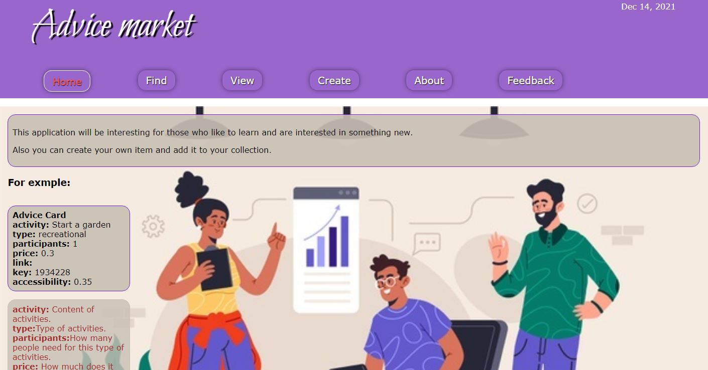

# About Avice market
This application will be interesting from student to old people.
Get link and enjoyed it!

Link to Heroku :   [Advice market][1] 

[1]: https://intense-reef-73479.herokuapp.com/ "Advice market"

<p>

</p>

## Installation
```
git clone https://github.com/webjsworker/Aliaksei_Yudziankou_tasks/tree/Advice_market/my-project
```
```
npm install 
```

## Usage
You can use this script for start application. 
```
npm start  
```

Run `ng serve` for a dev server. Navigate to `http://localhost:4200/`. The app will automatically reload if you change any of the source files.


## Code scaffolding
This project was generated with [Angular CLI](https://github.com/angular/angular-cli) version 13.0.2.

Run `ng generate component component-name` to generate a new component. You can also use `ng generate directive|pipe|service|class|guard|interface|enum|module`.

## Build

Run `ng build` to build the project. The build artifacts will be stored in the `dist/` directory.

## Running unit tests

Run `ng test` to execute the unit tests via [Karma](https://karma-runner.github.io).

## Running end-to-end tests

Run `ng e2e` to execute the end-to-end tests via a platform of your choice. To use this command, you need to first add a package that implements end-to-end testing capabilities.

## Further help

To get more help on the Angular CLI use `ng help` or go check out the [Angular CLI Overview and Command Reference](https://angular.io/cli) page.
